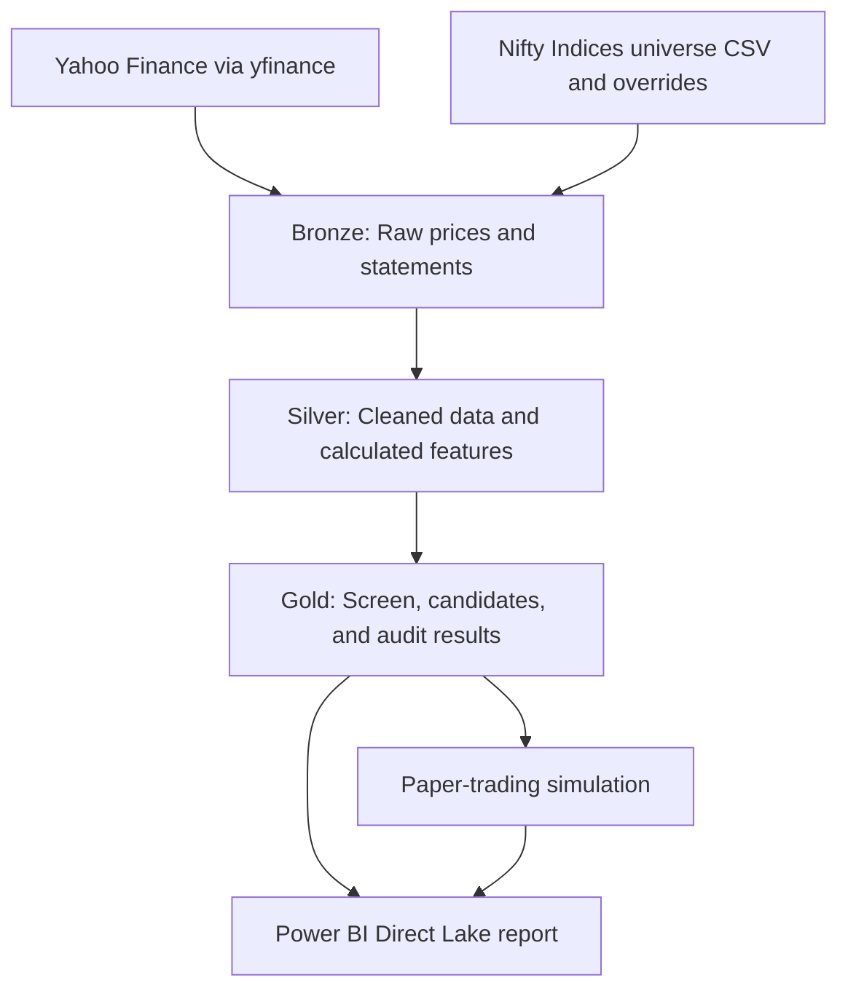

# NSE Equity Research & Paper-Trading Prototype on Microsoft Fabric

An educational stock-screening and paper-trading prototype built with **Microsoft Fabric**, **PySpark**, **Delta Lake**, and **Power BI**.

The project ingests available market and financial data, calculates price and fundamental features, ranks a non-financial NSE equity universe, and presents results in a Power BI report. Its paper-trading component simulates portfolio activity in Fabric; it does **not** connect to a broker or place real orders.

> **Project status:** Research prototype. Data coverage varies by symbol. Validate notebook and pipeline runs in Fabric before relying on their outputs.

---

## Project at a Glance

Verified data snapshot:

| Measure | Value |
|---|---:|
| Daily OHLCV records | 660,508 |
| Symbols in the price table | 398 |
| Price date range | 2019-01-02 to 2026-10-07 |
| Fundamental statement records | 40,035 |
| Annual fundamental records | 23,351 |
| Quarterly fundamental records | 16,684 |
| Symbols represented in fundamental tables | 397 |

Coverage varies by symbol and reporting period. The annual data contains 17 distinct period-end dates across companies’ differing fiscal periods, spanning 2021-12-31 to 2026-03-31; **that does not mean 17 years of history**. The quarterly data contains six period ends from 2025-03-31 to 2026-06-30.

These counts describe the dataset when it was checked and may change after later ingestion runs.

---

## What the Project Does

1. Loads an equity universe and applies financial-company exclusions.
2. Ingests daily price data and available annual and quarterly financial statements.
3. Creates price and fundamental features in Silver Delta tables.
4. Applies configurable eligibility rules and factor scores.
5. Produces a ranked candidate list with a sector limit.
6. Records data-quality check results.
7. Simulates paper trades using configured entry, exit, cash, and position-sizing rules.
8. Presents selected Lakehouse tables in Power BI using Direct Lake.

The screening factors are inspired by published investment approaches. They are quantitative proxies, not complete implementations of those investors’ methods.

---

## Architecture



### Medallion tables

**Bronze — source data**

- `bronze_universe_snapshot`
- `bronze_price_ohlcv`
- `bronze_fundamentals_long`
- `bronze_market_snapshot`
- `bronze_ingestion_log` (if created in the workspace)

**Silver — cleaned data and features**

- `silver_price_features`
- `silver_fundamental_features`
- `silver_market_regime`

**Gold — report-ready outputs**

- `gold_screen_current`
- `gold_stock_candidates`
- `gold_score_history`
- `gold_data_quality_results`
- `gold_run_audit`
- `gold_paper_portfolio`, `gold_paper_cash`, and `gold_paper_ledger` when the paper-trading tables have been initialized

---

## Screening Methodology

The scoring framework draws inspiration from several well-known investing styles:

| Inspiration | Example factors used |
|---|---|
| **Benjamin Graham** | P/E, P/B, leverage, earnings history |
| **Joel Greenblatt** | Return-on-capital proxy and earnings yield |
| **Peter Lynch** | Earnings growth, valuation relative to growth, cash-flow measures |
| **William O’Neil** | Relative strength, 52-week-high proximity, trend and earnings measures |

The specific formulas, thresholds, and weights are defined in the notebooks and configuration files. They can change as the project is tested. Review the code for the current implementation; the table above is a high-level description.

---

## Data Quality

The data-quality notebook checks source and derived data for issues such as:

- Missing or stale price and fundamental data
- Duplicate symbol/date records
- Invalid OHLC relationships
- Missing required metrics
- Invalid or extreme ratio values
- Market-regime data freshness

Results are written to `gold_data_quality_results` and summarized in `gold_run_audit`.

**Important:** In the current workflow, data-quality results are recorded after scoring. Do not assume a failed quality check automatically blocks candidate generation unless that control has been explicitly added and tested.

---

## Paper-Trading Simulation

The paper trader is a **simulation only**. It does not connect to a brokerage account and cannot place real orders.

The notebook is configured to simulate:

- A starting cash balance
- A maximum position size
- A price-based stop threshold
- Candidate-list-based exits
- Cash accounting and a closed-trade ledger

These rules are assumptions for testing software behavior, not investment recommendations. Simulated trades may not reflect real fills, slippage, fees, taxes, liquidity, or order-execution constraints. Check the notebook and configuration for the current settings.

### Paper-trading tables

| Table | Purpose |
|---|---|
| `gold_paper_cash` | Simulated cash balance |
| `gold_paper_portfolio` | Simulated open positions |
| `gold_paper_ledger` | Simulated closed trades and realized P&L |

---

## Backtesting

The project includes an exploratory backtest comparing rule-based screens with the Nifty 50 benchmark. The current reported run used four screen dates and a 90-day holding period, with a configured 0.5% transaction-cost assumption. Returns below are **observations from that run**, not forecasts, annualized returns, or evidence that a strategy will work in the future.

| Style | Screens tested | Picks recorded | Mean 90-day pick return | Picks beating Nifty | Best screen | Worst screen |
|---|---:|---:|---:|---:|---:|---:|
| Graham-inspired | 4 | 60 | +7.65% | 73.3% | +9.45% | +5.22% |
| Lynch-inspired | 2 | 17 | +5.89% | 52.9% | +7.72% | +4.06% |
| Greenblatt-inspired | 4 | 60 | +4.53% | 55.0% | +7.65% | +2.36% |
| O’Neil-inspired | 4 | 60 | +2.49% | 51.7% | +15.48% | -3.66% |
| Buffett-inspired | 4 | 60 | -0.95% | 41.7% | +4.04% | -4.18% |

The Lynch-inspired screen produced fewer observations than the other screens. The results should not be interpreted as statistically reliable performance estimates.

### Backtest limitations

- **Survivorship bias:** The screening universe is based on current constituents and may omit companies that were delisted or left the index.
- **Restatement and look-ahead risk:** Historical financial values may be revised, and an assumed reporting lag is not a substitute for actual publication timestamps.
- **Short sample:** Four screen dates—and fewer for some styles—are not enough to establish a persistent effect.
- **Overlapping holdings and periods:** Consecutive screens can contain many of the same companies, so observations are not independent.
- **Uneven data coverage:** Financial-statement availability varies by company and quarter.
- **Simplified costs and execution:** The transaction-cost assumption does not model all fees, taxes, market impact, liquidity, or actual trade fills.

Backtesting is used here to inspect the implementation and generate hypotheses. It does not establish that any screening style will outperform.

---

## Notebook Guide

The repository should contain only notebooks that have actually been exported and checked into GitHub.

| Notebook | Intended role |
|---|---|
| `NB01_Universe_Ingestion` | Loads and classifies the equity universe |
| `NB02_Price_Bronze_Ingestion` | Ingests daily price records |
| `NB03_Fundamental_Bronze_Ingestion` | Ingests available financial-statement metrics |
| `NB04_Silver_Price_Features` | Calculates price, trend, momentum, and liquidity features |
| `NB05_Silver_Fundamental_Features` | Calculates fundamental ratios and growth measures |
| `NB06_Scoring_and_Gold_Output` | Applies eligibility rules and writes screening outputs |
| `NB07_Data_Quality_Checks` | Records data-quality checks and audit status |
| `NB08_Paper_Trader` | Simulates portfolio actions without broker connectivity |
| `NB09_Backtest_Quarterly_v2` | Runs the exploratory historical backtest on demand |
| `NB10_Regime_Allocator` | Writes an advisory market-regime allocation summary |

A notebook being present in the repository does not mean it is part of the scheduled pipeline. Check the Fabric pipeline definition for its actual activities and order. Initialization or reset notebooks should not run as part of a recurring schedule if they overwrite simulation state.

---

## Power BI Report

The report uses a semantic model connected to the Lakehouse with **Direct Lake on OneLake**. Pages may include:

1. **Screening:** market regime, ranked candidates, factor values and sector distribution.
2. **Paper portfolio:** simulated cash, open positions and closed-trade ledger.
3. **Backtest and audit:** exploratory strategy results and data-quality checks.

Direct Lake does not refresh source data by itself. The relevant notebooks or pipeline must run successfully, and the report must query the updated tables.

<!-- Add screenshots after uploading them:


-->

---

## Technology Stack

- **Platform:** Microsoft Fabric, OneLake, Lakehouse, Data Pipelines
- **Processing and storage:** PySpark, Spark SQL, Delta Lake
- **Analysis:** Python, pandas
- **Reporting:** Power BI, DAX, Direct Lake
- **Data sources:** Yahoo Finance via `yfinance`; Nifty Indices constituent data

---

## Repository Structure

```text
.
├── notebooks/          # Exported Fabric notebooks
├── config/             # Safe configuration templates; no secrets
├── docs/               # Architecture, setup, methodology, and results
├── pipeline/           # Pipeline documentation or exported definition
├── powerbi/            # DAX measures and semantic-model notes
├── images/             # Redacted screenshots and diagrams
└── README.md
```

Do not commit API keys, tokens, credentials, private workspace details, or personal portfolio data. Example configuration files should contain safe sample values.

---

## Reproducing the Project

This repository documents a Microsoft Fabric project; cloning it locally is not sufficient to run it. Reproduction requires:

1. A Microsoft Fabric workspace with a Lakehouse.
2. The reference universe and configuration files expected by the notebooks.
3. Required libraries available in the Fabric environment.
4. Notebooks attached to the correct Lakehouse.
5. Running notebooks in dependency order.
6. A semantic model and Power BI report configured against the resulting tables.

Pipeline schedules, workspace connections, permissions, library settings, and Direct Lake model configuration are managed in Fabric and may not be fully represented by exported notebook files.

---

## Disclaimer

This is an educational data-engineering and financial-research prototype. It is not financial advice, a live brokerage system, or a promise of investment performance. The paper-trading component does not place real orders. Historical test results have the limitations described above, and past results do not predict future performance.
