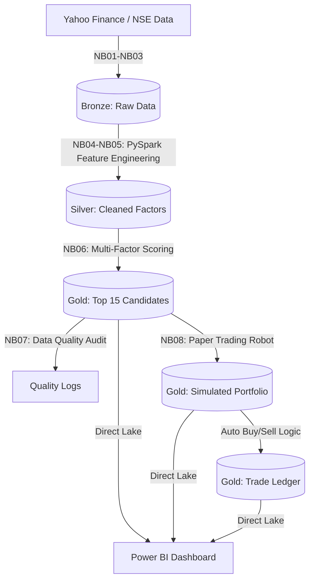

# 📈 Quantitative Stock Selection Engine on Microsoft Fabric

An end-to-end, fully automated quantitative stock screening and **paper trading** system built entirely on **Microsoft Fabric**.

This system ingests historical market data and financial statements, processes them through a Medallion Architecture (Bronze/Silver/Gold) using **PySpark** and **Delta Lake**, evaluates them against legendary investing frameworks, autonomously manages a simulated ₹10,00,000 portfolio, and serves live signals to a **Power BI Direct Lake** dashboard.

---

## 🏗️ Architecture



---

## 🧠 Investment Methodologies Implemented

The scoring engine evaluates the Nifty 500 universe using four quantitative philosophies:

| Philosophy | Key Metrics | Implementation |
|---|---|---|
| **Benjamin Graham** | `P/E × P/B ≤ 22.5`, `D/E ≤ 1.0`, 4-year earnings stability | Defensive value gates |
| **Joel Greenblatt** | ROIC + Earnings Yield ranking | Magic Formula composite |
| **Peter Lynch** | PEG ratio, Cumulative `OCF/NI ≥ 0.8` | Cash flow truth testing |
| **William O'Neil** | RS Rank ≥ 70, within 15% of 52-week high, > 200 SMA | CAN SLIM momentum |

---

## 🤖 Automated Paper Trading Engine

Unlike manual portfolio tracking, this system includes a **fully autonomous trading robot** simulating a ₹10,00,000 portfolio:

- **Auto-Buy:** Purchases top-ranked candidates when cash is available (max ₹50,000 per position)
- **Auto-Sell:** Exits on 7% stop-loss OR when a stock drops out of the Top 15
- **Cash Management:** Tracks balance, reinvests proceeds from sales
- **Trade Ledger:** Records every closed trade with realized P&L and exit reason

### Paper Trading Tables

| Table | Purpose |
|---|---|
| `gold_paper_cash` | Simulated cash balance |
| `gold_paper_portfolio` | Active simulated holdings |
| `gold_paper_ledger` | Historical closed trades with P&L |

**No broker API required. No real money at risk.**

---

## ⚙️ Data Pipeline (8 Notebooks)

| Notebook | Purpose | Frequency |
|---|---|---|
| `NB01_Universe_Ingestion` | Clean Nifty 500 list, exclude financials | Monthly |
| `NB02_Price_Bronze_Ingestion` | Daily OHLCV ingestion with browser headers | Weekly |
| `NB03_Fundamental_Bronze_Ingestion` | Multi-statement financials (P&L, BS, CF) | Weekly |
| `NB04_Silver_Price_Features` | RS Rank, SMA 200, 52-week high, momentum | Weekly |
| `NB05_Silver_Fundamental_Features` | ROIC, Earnings Yield, 4-year CAGRs, cash truth | Weekly |
| `NB06_Scoring_and_Gold_Output` | Eligibility gates, percentile scoring, sector caps | Weekly |
| `NB07_Data_Quality_Checks` | 14-point automated audit | Weekly |
| `NB08_Paper_Trader` | Autonomous buy/sell simulation | Weekly |
| `NB09_Backtest_Quarterly` | Historical strategy validation | On-demand |

---

## 📊 Backtest Results (Aug 2025 – May 2026)

| Style | Avg Return | Win Rate vs Nifty | Best Screen | Worst Screen |
|---|---|---|---|---|
| **Graham** | +7.65% | 73.3% | +9.45% | +5.22% |
| **Lynch** | +5.89% | 52.9% | +7.72% | +4.06% |
| **Greenblatt** | +4.53% | 55.0% | +7.65% | +2.36% |
| **O'Neil** | +2.49% | 51.7% | +15.48% | -3.66% |
| **Buffett** | -0.95% | 41.7% | +4.04% | -4.18% |

*Net of 0.5% transaction costs. Quarterly rebalancing, 90-day holding period.*

---

## 🛠️ Tech Stack

- **Platform:** Microsoft Fabric (Lakehouse, Notebooks, Data Pipelines)
- **Processing:** PySpark, Delta Lake
- **Storage:** OneLake (Medallion Architecture)
- **Visualization:** Power BI (Direct Lake mode)
- **Data Sources:** Yahoo Finance (`yfinance`), NSE Indices

---

## 📁 Repository Structure

```
├── notebooks/          # 10 PySpark notebooks (ingestion → scoring → simulation)
├── config/             # Model parameters and financial exclusion overrides
├── powerbi/            # DAX measures and dashboard specifications
├── images/             # Dashboard screenshots and architecture diagrams
└── README.md
```

---

## ⚠️ Disclaimer

This repository is for **educational and portfolio demonstration purposes only**. It is not financial advice. Past backtest performance does not guarantee future results. Always conduct independent research before investing real capital.
